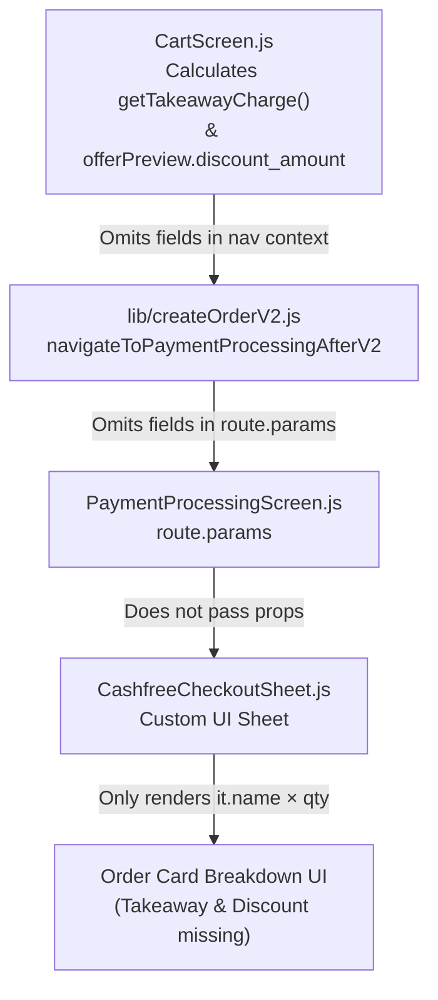

# Comprehensive Technical Implementation Plan: Network Error Handling, Out-of-Stock Formatting, and Cashfree Breakdown

**Document Version:** 1.1  
**Target Release:** HungerTap Student App v1.0.10 (build 10)  
**Date:** 2026-10-01  
**Status:** Ready for Execution  

---

## Table of Contents
1. [Overview & Objectives](#1-overview--objectives)
2. [Bug 1: Network Failure While Fetching Payment Gateways](#2-bug-1-network-failure-while-fetching-payment-gateways)
   - [2.1 Current Problem & User Impact](#21-current-problem--user-impact)
   - [2.2 Root Cause Analysis](#22-root-cause-analysis)
   - [2.3 Proposed Architecture & UI Design](#23-proposed-architecture--ui-design)
   - [2.4 Concrete Code Changes](#24-concrete-code-changes)
3. [Bug 2: "Mention Out of Stock, Remove That 0 Out 1"](#3-bug-2-mention-out-of-stock-remove-that-0-out-1)
   - [3.1 Current Problem & User Impact](#31-current-problem--user-impact)
   - [3.2 Root Cause Analysis (All 3 Touchpoints)](#32-root-cause-analysis-all-3-touchpoints)
   - [3.3 Proposed Solution & UI Behavior](#33-proposed-solution--ui-behavior)
   - [3.4 Concrete Code Changes](#34-concrete-code-changes)
4. [Bug 3: Cashfree Checkout Missing Takeaway Fees & Coupon Discount](#4-bug-3-cashfree-checkout-missing-takeaway-fees--coupon-discount)
   - [4.1 Current Problem & User Impact](#41-current-problem--user-impact)
   - [4.2 End-to-End Data Flow Disconnect](#42-end-to-end-data-flow-disconnect)
   - [4.3 Proposed Solution & Financial Breakdown Contract](#43-proposed-solution--financial-breakdown-contract)
   - [4.4 Concrete Code Changes Across the Pipeline](#44-concrete-code-changes-across-the-pipeline)
5. [Affected Files Matrix](#5-affected-files-matrix)
6. [Edge Cases & Error Handling Checklist](#6-edge-cases--error-handling-checklist)
7. [Step-by-Step Verification & Testing Protocol](#7-step-by-step-verification--testing-protocol)

---

## 1. Overview & Objectives

This document provides a complete, unambiguous technical plan to resolve three user-experience defects in the HungerTap student mobile app:

1. **Clear Network Connectivity Messaging in Cart:** When internet drops or fails during payment gateway initialization, replace misleading "unavailable" messages with an explicit **"No Internet Connection"** notice and a direct **"Retry"** action.
2. **Clean "Out of Stock" Display:** Eliminate confusing numeric counters such as `(1)`, `[-] 0 [+]`, and `"you have 1 but only 0 can be ordered"` so that out-of-stock items cleanly and consistently state **"Out of stock"**.
3. **Transparent Cashfree Bill Breakdown:** Ensure the custom Cashfree checkout sheet displays the full arithmetic breakdown of the user's order — including item line totals, **Takeaway Charge(s)**, and **Coupon Discount** — so the itemized list matches the final **Amount payable** to the rupee.

---

## 2. Bug 1: Network Failure While Fetching Payment Gateways

### 2.1 Current Problem & User Impact
When a student opens the Cart screen while experiencing a network timeout, intermittent 4G/5G, or no internet:
1. `loadGateways()` in [screens/CartScreen.js](file:///d:/PROJECTS/hungertap_app21/screens/CartScreen.js#L1037) calls `fetchActivePaymentGateways()`.
2. The network request fails with a `TypeError: Network request failed` or `AbortError`.
3. The catch block returns `{ success: false, data: null, error: 'Network request failed' }`.
4. `CartScreen.js` treats this as a generic gateway failure and displays:
   > ⚠️ Payment methods currently unavailable. Please try again later.
5. The "Place Order" button at the bottom is disabled (`opacity: 0.55`).
6. **User Frustration:**
   - The user assumes HungerTap’s payment system is down or that the canteen is not accepting payments, when in reality their own internet was momentarily disconnected.
   - There is **no "Retry" button**. The user has no obvious way to re-attempt fetching payment gateways without pulling down the entire cart to refresh (which many users do not think to do).
   - Tapping the disabled button gives zero feedback.

---

### 2.2 Root Cause Analysis
In [screens/CartScreen.js](file:///d:/PROJECTS/hungertap_app21/screens/CartScreen.js#L1037-L1062):
```javascript
// Current implementation
const loadGateways = useCallback(async () => {
  setGatewayLoading(true);
  const res = await fetchActivePaymentGateways();

  if (!res.success || !res.data) {
    setGatewayError(true);        // <--- No distinction between offline vs DB down
    setGatewayLoading(false);
    return;
  }
  ...
}, []);
```
And in lines 1978–1984:
```javascript
{gatewayLoading ? (
  <ActivityIndicator size="small" style={{ marginVertical: 12 }} color="#E5A93B" />
) : gatewayError ? (
  <View style={{ padding: 12, backgroundColor: 'rgba(255,77,77,0.1)', borderRadius: 8, marginVertical: 12 }}>
    <Text style={{ color: '#FF4D4D', fontWeight: '600', fontSize: 13 }}>
      ⚠️ Payment methods currently unavailable. Please try again later.
    </Text>
  </View>
) : (
  <PaymentGatewaySelector ... />
)}
```
The application already has comprehensive network diagnostic utilities in [lib/network.js](file:///d:/PROJECTS/hungertap_app21/lib/network.js) and [lib/orderFlowErrors.js](file:///d:/PROJECTS/hungertap_app21/lib/orderFlowErrors.js) (`isNetworkConnectivityFailure`, `isNetworkError`), but they are currently ignored during gateway loading.

---

### 2.3 Proposed Architecture & UI Design

#### State Design
Replace binary `gatewayError` with specific error classification:
- `gatewayLoading: boolean` (initial load)
- `gatewayRetrying: boolean` (inline retry button spinner)
- `gatewayError: boolean` (general flag for disabling checkout)
- `gatewayErrorKind: 'network' | 'unavailable' | null`

#### Error Detection
```javascript
const isNet = isNetworkConnectivityFailure(res.error) || isNetworkError(res.error);
setGatewayErrorKind(isNet ? 'network' : 'unavailable');
```

#### Visual Component Specifications
When `gatewayErrorKind === 'network'`:
- **Card Background:** Light orange/amber tint in light mode (`#FFF8E8`), subtle dark-card in dark mode (`#1E1A14`), border: `rgba(229, 169, 59, 0.4)`.
- **Icon:** `cloud-offline-outline` (size 22, color `#D97706`).
- **Heading:** `"No Internet Connection"` (bold, 14px, `#92400E` / `#FBBF24`).
- **Body:** `"Unable to load payment methods. Please check your network connection and tap Retry."` (12px, `#78350F` / `#D1D5DB`).
- **Action Button:** A high-contrast **"Retry"** button with a reload icon or small spinner:
  - Background: `#E5A93B`
  - Text: `"Retry"` (semi-bold, 12px, white)
  - Calls `loadGateways({ isRetry: true })`.

#### Bottom Button Offline Tap Feedback
If `gatewayErrorKind === 'network'` and the user taps the checkout area:
- Show an immediate in-app toast: `"No internet connection. Please reconnect and tap Retry above to enable checkout."`

---

### 2.4 Concrete Code Changes

#### File: [screens/CartScreen.js](file:///d:/PROJECTS/hungertap_app21/screens/CartScreen.js)
1. **Import network utilities:**
   ```javascript
   import { isNetworkError } from '../lib/network';
   ```
2. **Update State:**
   ```javascript
   const [gatewayLoading, setGatewayLoading] = useState(true);
   const [gatewayRetrying, setGatewayRetrying] = useState(false);
   const [gatewayError, setGatewayError] = useState(false);
   const [gatewayErrorKind, setGatewayErrorKind] = useState(null); // 'network' | 'unavailable' | null
   ```
3. **Enhance `loadGateways`:**
   ```javascript
   const loadGateways = useCallback(async ({ isRetry = false } = {}) => {
     if (isRetry) {
       setGatewayRetrying(true);
     } else {
       setGatewayLoading(true);
     }
     
     try {
       const res = await fetchActivePaymentGateways();

       if (!res.success || !res.data) {
         const isNet = isNetworkConnectivityFailure(res?.error) || isNetworkError(res?.error);
         setGatewayError(true);
         setGatewayErrorKind(isNet ? 'network' : 'unavailable');
         return;
       }

       const activeList = res.data;
       setGateways(activeList);

       if (activeList.length === 0) {
         setGatewayError(true);
         setGatewayErrorKind('unavailable');
         return;
       }

       setGatewayError(false);
       setGatewayErrorKind(null);
       setSelectedGateway((prev) => {
         if (prev && activeList.some((g) => g.code === prev)) return prev;
         const defaultGw = activeList.find((g) => g.is_default) || activeList[0];
         return defaultGw.code;
       });
     } finally {
       setGatewayLoading(false);
       setGatewayRetrying(false);
     }
   }, []);
   ```
4. **Update Gateway Render Section:**
   ```jsx
   {gatewayLoading ? (
     <ActivityIndicator size="small" style={{ marginVertical: 12 }} color="#E5A93B" />
   ) : gatewayError ? (
     gatewayErrorKind === 'network' ? (
       <View style={styles.networkErrorCard}>
         <View style={styles.networkErrorIconRow}>
           <AppIcon name="cloud-offline-outline" size={24} color="#D97706" />
           <View style={{ flex: 1, marginLeft: 10 }}>
             <Text style={styles.networkErrorTitle}>No Internet Connection</Text>
             <Text style={styles.networkErrorSubtitle}>
               Unable to load payment methods. Please check your internet connection and try again.
             </Text>
           </View>
         </View>
         <TouchableOpacity
           style={styles.networkRetryButton}
           onPress={() => loadGateways({ isRetry: true })}
           disabled={gatewayRetrying}
           activeOpacity={0.8}
         >
           {gatewayRetrying ? (
             <ActivityIndicator size="small" color="#FFFFFF" />
           ) : (
             <>
               <AppIcon name="refresh" size={14} color="#FFFFFF" style={{ marginRight: 6 }} />
               <Text style={styles.networkRetryText}>Retry</Text>
             </>
           )}
         </TouchableOpacity>
       </View>
     ) : (
       <View style={styles.gatewayUnavailableCard}>
         <Text style={styles.gatewayUnavailableText}>
           ⚠️ Payment methods currently unavailable. Please try again later.
         </Text>
       </View>
     )
   ) : (
     <PaymentGatewaySelector
       gateways={gateways}
       selectedGateway={selectedGateway}
       onSelectGateway={setSelectedGateway}
     />
   )}
   ```

---

## 3. Bug 2: "Mention Out of Stock, Remove That 0 Out 1"

### 3.1 Current Problem & User Impact
The user reported:
> *"bug 2 :- mention out of stock , remove that 0 out 1"*

Upon inspecting all locations where stock and unavailable states are rendered, there are three distinct touchpoints producing confusing "0 out of 1" or "(1)" artifacts:

1. **Touchpoint A (Category Header in Home Screen):**
   In [screens/HomeScreen.js](file:///d:/PROJECTS/hungertap_app21/screens/HomeScreen.js#L1532), when one item in a category is out of stock, the section header prints:
   `Out of stock (1)`
   This count indicator `(1)` is easily misread as `0 out of 1` or an availability ratio `0/1`.
2. **Touchpoint B (Cart Validation Message on Insufficient Stock):**
   In [lib/cartCheckout.js](file:///d:/PROJECTS/hungertap_app21/lib/cartCheckout.js#L93), when an item has `available_stock = 0` and the user had `quantity = 1` in their cart:
   ```javascript
   `${line.name || 'Item'}: you have ${line.quantity} but only ${maxQ} can be ordered now.`
   ```
   This evaluates to:
   `"Item: you have 1 but only 0 can be ordered now."`
   This is literally the confusing `"1 but only 0"` ("0 out of 1") message.
3. **Touchpoint C (Item Detail Screen Quantity Stepper):**
   In [screens/ItemDetailScreen.js](file:///d:/PROJECTS/hungertap_app21/screens/ItemDetailScreen.js#L200-L241), when `!item.isAvailable`:
   The screen continues to render the full quantity selector row:
   `[-]  0  [+]`
   with disabled buttons and the number `0` in the center, right above the button marked "Out of Stock". Having a quantity counter showing `0` next to an unavailable item causes visual noise and confusion.

---

### 3.2 Root Cause Analysis (All 3 Touchpoints)

| Location | File | Current Faulty Code | Resulting User Text |
|---|---|---|---|
| **Header** | `screens/HomeScreen.js:1532` | `Out of stock{item.count > 0 ? ` (${item.count})` : ''}` | `"Out of stock (1)"` |
| **Validation** | `lib/cartCheckout.js:93` | `${line.name}: you have ${line.quantity} but only ${maxQ} can be ordered now.` | `"Veg Puff: you have 1 but only 0 can be ordered now."` |
| **Detail Stepper** | `screens/ItemDetailScreen.js:224` | `<Text style={styles.quantityText}>{displayQuantity}</Text>` | Displays stepper with `0` inside when unavailable |

---

### 3.3 Proposed Solution & UI Behavior

1. **Section Header ([HomeScreen.js](file:///d:/PROJECTS/hungertap_app21/screens/HomeScreen.js)):**
   Remove the counter suffix `(${item.count})`. The header must always render cleanly as:
   **"Out of stock"**
2. **Cart Stock Validation ([cartCheckout.js](file:///d:/PROJECTS/hungertap_app21/lib/cartCheckout.js)):**
   When `maxQ <= 0`, do NOT format `"you have 1 but only 0"`. Instead, immediately output:
   `"${line.name || 'Item'} is out of stock."`
   (Only use `"you have X but only Y can be ordered"` when `maxQ > 0` and the customer requested more than remaining stock).
3. **Detail Screen ([ItemDetailScreen.js](file:///d:/PROJECTS/hungertap_app21/screens/ItemDetailScreen.js)):**
   When `!item.isAvailable`:
   - Hide the `[-] 0 [+]` quantity selector row completely.
   - Render only the full-width disabled **"Out of Stock"** button.
4. **Food Card ([components/ModernComponents.js](file:///d:/PROJECTS/hungertap_app21/components/ModernComponents.js)):**
   Ensure food cards cleanly display the **"OUT OF STOCK"** overlay and disabled button without displaying `0` or partial quantity indicators.

---

### 3.4 Concrete Code Changes

#### Change 2A: [screens/HomeScreen.js](file:///d:/PROJECTS/hungertap_app21/screens/HomeScreen.js) (Line 1530)
```javascript
// BEFORE:
    if (item.__rowType === 'oos_header') {
      return (
        <View style={styles.oosSectionHeader}>
          <Text style={styles.oosSectionTitle}>
            Out of stock{item.count > 0 ? ` (${item.count})` : ''}
          </Text>
        </View>
      );
    }

// AFTER:
    if (item.__rowType === 'oos_header') {
      return (
        <View style={styles.oosSectionHeader}>
          <Text style={styles.oosSectionTitle}>Out of stock</Text>
        </View>
      );
    }
```

#### Change 2B: [lib/cartCheckout.js](file:///d:/PROJECTS/hungertap_app21/lib/cartCheckout.js) (Lines 89–96)
```javascript
// BEFORE:
    const stockErrors = [];
    for (const line of cartAfterCanteen) {
      const maxQ = maxOrderableQtyForItem(line);
      if (line.quantity > maxQ) {
        stockErrors.push(
          `${line.name || 'Item'}: you have ${line.quantity} but only ${maxQ} can be ordered now.`
        );
      }
    }

// AFTER:
    const stockErrors = [];
    for (const line of cartAfterCanteen) {
      const maxQ = maxOrderableQtyForItem(line);
      if (line.quantity > maxQ) {
        if (maxQ <= 0) {
          stockErrors.push(`${line.name || 'Item'} is out of stock.`);
        } else {
          stockErrors.push(
            `${line.name || 'Item'}: you have ${line.quantity} but only ${maxQ} can be ordered now.`
          );
        }
      }
    }
```

#### Change 2C: [screens/ItemDetailScreen.js](file:///d:/PROJECTS/hungertap_app21/screens/ItemDetailScreen.js) (Lines 199–243)
```javascript
// BEFORE: Always rendering quantity selector row
        <View style={styles.quantityContainer}>
          <TouchableOpacity ...>...</TouchableOpacity>
          <Text style={[styles.quantityText, { color: colors.text }]}>{displayQuantity}</Text>
          <TouchableOpacity ...>...</TouchableOpacity>
        </View>

// AFTER: Only show quantity controls if item is available
        {item.isAvailable ? (
          <View style={styles.quantityContainer}>
            <TouchableOpacity
              style={[
                styles.quantityButton,
                { backgroundColor: colors.elevatedSurface },
                cartQuantity === 0 && styles.quantityButtonDisabled,
              ]}
              onPress={handleDecreaseQuantity}
              disabled={cartQuantity === 0}
            >
              {cartQuantity === 1 ? (
                <AppIcon name="trash-outline" size={18} color={colors.text} />
              ) : (
                <View
                  style={[
                    styles.minusLine,
                    { backgroundColor: colors.text },
                    cartQuantity === 0 && styles.minusLineDisabled,
                  ]}
                />
              )}
            </TouchableOpacity>

            <Text style={[styles.quantityText, { color: colors.text }]}>{displayQuantity}</Text>

            <TouchableOpacity
              style={[
                styles.quantityButton,
                { backgroundColor: colors.elevatedSurface },
              ]}
              onPress={handleIncreaseQuantity}
            >
              <AppIcon name="add" size={18} color={colors.text} />
            </TouchableOpacity>
          </View>
        ) : null}
```

---

## 4. Bug 3: Cashfree Checkout Missing Takeaway Fees & Coupon Discount

### 4.1 Current Problem & User Impact
The user reported:
> *"bug 3:- cashfree sdk not mentioning the takeaway fees adn coupon amount , check that"*

When a student checks out using Cashfree:
1. They may choose **Takeaway** (which adds a per-canteen fee, e.g. ₹10.00).
2. They may apply an offer / coupon code (e.g. `WELCOME50` providing -₹30.00 discount).
3. In the Cart screen, the total payable correctly reflects:
   $$\text{Payable} = \text{Food Subtotal} + \text{Takeaway Fee} - \text{Coupon Discount}$$
4. When the Cashfree checkout sheet opens, the user taps **"Your order · X items"** to expand the breakdown.
5. **The Bug:**
   The card **only** lists food item lines and the total:
   ```text
   Veg Fried Rice × 1           ₹120.00
   Paneer Roll × 2              ₹128.00
   ─────────────────────────────────────
   Amount payable               ₹238.00   <-- (Mismatch! 120 + 128 = 248, not 238)
   ```
   Because **Takeaway Charge (+₹10)** and **Discount (-₹20)** are omitted:
   - The user cannot see whether their coupon was actually applied.
   - The math does not add up, causing hesitation and lost trust right before paying.

---

### 4.2 End-to-End Data Flow Disconnect

A complete trace through the codebase reveals that the values are lost across four boundaries:



1. **[screens/CartScreen.js](file:///d:/PROJECTS/hungertap_app21/screens/CartScreen.js#L1390):**
   Calls `navigateToPaymentProcessingAfterV2(navigation, supabase, v2, { userId, orderItems, orderTotal, isTakeaway })` — **missing `takeawayCharge`, `discountAmount`, `offerCode`**.
2. **[lib/createOrderV2.js](file:///d:/PROJECTS/hungertap_app21/lib/createOrderV2.js#L333):**
   `navigation.navigate('PaymentProcessing', { ... })` — **omits `takeawayCharge`, `discountAmount`, `offerCode`**.
3. **[screens/PaymentProcessingScreen.js](file:///d:/PROJECTS/hungertap_app21/screens/PaymentProcessingScreen.js#L380):**
   Does not destructure `takeawayCharge`, `discountAmount`, or `offerCode` from `route.params`, nor pass them to `<CashfreeCheckoutSheet />`.
4. **[components/cashfree/CashfreeCheckoutSheet.js](file:///d:/PROJECTS/hungertap_app21/components/cashfree/CashfreeCheckoutSheet.js#L330-L346):**
   The component does not accept or render `takeawayCharge` or `discountAmount`.
5. **[cashfree-ui-preview/index.html](file:///d:/PROJECTS/hungertap_app21/cashfree-ui-preview/index.html#L202-L207):**
   The HTML preview template mirrors the same omission.

---

### 4.3 Proposed Solution & Financial Breakdown Contract

#### Prop Interface for `CashfreeCheckoutSheet`
Add three props:
- `takeawayCharge?: number` (e.g. `10.00`)
- `discountAmount?: number` (e.g. `25.00`)
- `offerCode?: string` (e.g. `'TASTY50'`)

#### Breakdown Render Contract
In the expanded `orderCard`:
1. Render all food item rows: `Item Name × Qty` -> `₹Amount`.
2. If `isTakeaway && Number(takeawayCharge) > 0`:
   - Label: `Takeaway Charge(s)`
   - Amount: `₹XX.XX` (regular ink color)
3. If `Number(discountAmount) > 0`:
   - Label: `Discount (OFFER_CODE)` (or `Discount` if code empty)
   - Amount: `−₹XX.XX` (styled with `C.leaf` / green: `#15803d`)
4. Divider line.
5. Total row: `Amount payable` -> `₹XX.XX`.

---

### 4.4 Concrete Code Changes Across the Pipeline

#### Step 4A: [screens/CartScreen.js](file:///d:/PROJECTS/hungertap_app21/screens/CartScreen.js) (Line 1390)
Pass the breakdown values into `navigateToPaymentProcessingAfterV2`:
```javascript
        const nav = await navigateToPaymentProcessingAfterV2(navigation, supabase, v2, {
          userId,
          orderItems: [...linesForOrder],
          orderTotal,
          isTakeaway: args.p_is_takeaway,
          takeawayCharge: getTakeawayCharge(),
          discountAmount: Number(offerPreview?.discount_amount || 0),
          offerCode: appliedOffer?.code || '',
        });
```

#### Step 4B: [lib/createOrderV2.js](file:///d:/PROJECTS/hungertap_app21/lib/createOrderV2.js) (Line 333)
Forward the fields in `navigation.navigate`:
```javascript
    navigation.navigate('PaymentProcessing', {
      gateway,
      paymentSessionId,
      paymentUrl: v2.payment_url || String(v2.data?.payment_url || '').trim(),
      environment,
      orderId,
      paymentId: paymentId || undefined,
      orderItems: [...orderItems],
      orderTotal,
      isTakeaway: !!ctx?.isTakeaway,
      takeawayCharge: Number(ctx?.takeawayCharge || 0),
      discountAmount: Number(ctx?.discountAmount || 0),
      offerCode: ctx?.offerCode ? String(ctx.offerCode) : '',
      cashfreeOrderId: orderId,
    });
```

#### Step 4C: [screens/PaymentProcessingScreen.js](file:///d:/PROJECTS/hungertap_app21/screens/PaymentProcessingScreen.js)
1. **Destructure route params (Line 380):**
   ```javascript
     const {
       gateway = 'cashfree',
       paymentUrl: initialPaymentUrl,
       paymentSessionId: initialPaymentSessionId,
       environment: initialEnvironment,
       cashfreeOrderId: initialCashfreeOrderId,
       orderId: initialOrderId,
       paymentId: initialPaymentId,
       orderItems = [],
       orderTotal = 0,
       isTakeaway = false,
       takeawayCharge = 0,
       discountAmount = 0,
       offerCode = '',
       ...
     } = route.params || {};
   ```
2. **Pass to `<CashfreeCheckoutSheet />` (Line 1365):**
   ```jsx
         <CashfreeCheckoutSheet
           paymentSessionId={cashfreeSessionId}
           orderId={cashfreeOrderId || checkoutOrderId}
           environment={environment}
           orderItems={orderItems}
           orderTotal={orderTotal}
           isTakeaway={isTakeaway}
           takeawayCharge={takeawayCharge}
           discountAmount={discountAmount}
           offerCode={offerCode}
           attempt={cfAttempt}
           onPaymentLaunched={() => {
             cfProcessingRef.current = true;
           }}
           onCancelOrder={promptAbandonCheckout}
           onBackToCart={() => {
             allowLeaveRef.current = true;
             resetNavigationToCart(navigation);
           }}
         />
   ```

#### Step 4D: [components/cashfree/CashfreeCheckoutSheet.js](file:///d:/PROJECTS/hungertap_app21/components/cashfree/CashfreeCheckoutSheet.js)
1. **Accept props in component signature (Line 110):**
   ```javascript
   export default function CashfreeCheckoutSheet({
     paymentSessionId,
     orderId,
     environment,
     orderItems = [],
     orderTotal = 0,
     isTakeaway = false,
     takeawayCharge = 0,
     discountAmount = 0,
     offerCode = '',
     attempt = null,
     onPaymentLaunched,
     onCancelOrder,
     onBackToCart,
   }) {
   ```
2. **Render rows in order summary disclosure (Lines 330–347):**
   ```jsx
           {open ? (
             <View style={s.orderCard}>
               {lines.map((it, i) => {
                 const qty = Math.max(1, Number(it?.quantity) || 1);
                 const unit = resolveItemUnitPrice(it);
                 return (
                   <View key={`${it?.id ?? i}`} style={s.orderRow}>
                     <Text style={s.orderItem} numberOfLines={1}>{`${it?.name || 'Item'} × ${qty}`}</Text>
                     {unit > 0 ? <Text style={s.orderPrice}>{formatInr(unit * qty)}</Text> : null}
                   </View>
                 );
               })}
               {isTakeaway && Number(takeawayCharge) > 0 ? (
                 <View style={s.orderRow}>
                   <Text style={s.orderItem}>Takeaway Charge(s)</Text>
                   <Text style={s.orderPrice}>{formatInr(takeawayCharge)}</Text>
                 </View>
               ) : null}
               {Number(discountAmount) > 0 ? (
                 <View style={s.orderRow}>
                   <Text style={s.orderItem}>
                     {offerCode ? `Discount (${offerCode})` : 'Discount'}
                   </Text>
                   <Text style={[s.orderPrice, { color: C.leaf }]}>
                     −{formatInr(discountAmount)}
                   </Text>
                 </View>
               ) : null}
               <View style={s.divider} />
               <View style={s.orderRow}>
                 <Text style={s.orderTotalLabel}>Amount payable</Text>
                 <Text style={s.orderTotalValue}>{amountLabel}</Text>
               </View>
             </View>
           ) : null}
   ```

#### Step 4E: [cashfree-ui-preview/index.html](file:///d:/PROJECTS/hungertap_app21/cashfree-ui-preview/index.html) (Lines 202–207)
Synchronize the preview card:
```html
          <div class="order-card" id="orderCard">
            <div class="order-row"><span class="n">Veg Fried Rice × 1</span><span class="p">₹120.00</span></div>
            <div class="order-row"><span class="n">Paneer Roll × 2</span><span class="p">₹128.00</span></div>
            <div class="order-row"><span class="n">Takeaway Charge(s)</span><span class="p">₹10.00</span></div>
            <div class="order-row"><span class="n">Discount (WELCOME50)</span><span class="p" style="color:var(--leaf)">−₹10.00</span></div>
            <div class="divider"></div>
            <div class="order-row total"><span class="n">Amount payable</span><span class="p">₹248.00</span></div>
          </div>
```

---

## 5. Affected Files Matrix

| File Path | Component / Layer | Primary Modifications |
|---|---|---|
| [screens/CartScreen.js](file:///d:/PROJECTS/hungertap_app21/screens/CartScreen.js) | Cart & Checkout Screen | 1. Differentiate network vs server gateway errors.<br>2. Add "No Internet" card with interactive "Retry" button.<br>3. Forward `takeawayCharge`, `discountAmount`, `offerCode` to checkout. |
| [screens/HomeScreen.js](file:///d:/PROJECTS/hungertap_app21/screens/HomeScreen.js) | Home & Menu Screen | Remove count `(${item.count})` from `"Out of stock"` section header. |
| [screens/ItemDetailScreen.js](file:///d:/PROJECTS/hungertap_app21/screens/ItemDetailScreen.js) | Food Item Detail Screen | Hide `[-] 0 [+]` stepper row when item is out of stock. |
| [lib/cartCheckout.js](file:///d:/PROJECTS/hungertap_app21/lib/cartCheckout.js) | Order Validation Engine | Avoid `"you have 1 but only 0"` error string; cleanly emit `"<Item> is out of stock"`. |
| [lib/createOrderV2.js](file:///d:/PROJECTS/hungertap_app21/lib/createOrderV2.js) | Checkout Navigation Adapter | Forward `takeawayCharge`, `discountAmount`, `offerCode` to `PaymentProcessingScreen`. |
| [screens/PaymentProcessingScreen.js](file:///d:/PROJECTS/hungertap_app21/screens/PaymentProcessingScreen.js) | Payment Router & Container | Read params and inject `takeawayCharge`, `discountAmount`, `offerCode` into `CashfreeCheckoutSheet`. |
| [components/cashfree/CashfreeCheckoutSheet.js](file:///d:/PROJECTS/hungertap_app21/components/cashfree/CashfreeCheckoutSheet.js) | Cashfree SDK Custom UI Sheet | Accept props and render Takeaway Charge and Discount rows in order summary disclosure. |
| [cashfree-ui-preview/index.html](file:///d:/PROJECTS/hungertap_app21/cashfree-ui-preview/index.html) | Developer UI Preview | Update mock order breakdown with Takeaway and Discount rows. |

---

## 6. Edge Cases & Error Handling Checklist

- [x] **Zero Discount Case:** If no coupon is applied, `discountAmount` is `0`; the discount row MUST NOT render.
- [x] **Zero / Dine-In Takeaway Case:** If the user selected Dine-in or the canteen has ₹0 takeaway charges, the takeaway charge row MUST NOT render.
- [x] **Network Offline -> Online Recovery:** When internet reconnects, tapping the **"Retry"** button in Cart immediately re-triggers `fetchActivePaymentGateways()` and restores the gateway picker and checkout button without requiring page reload.
- [x] **Pull-to-Refresh Sync:** `onRefresh()` in `CartScreen.js` already calls `loadGateways()`. It will automatically reset `gatewayErrorKind` when connectivity returns.
- [x] **Non-Cashfree Gateways Safe:** Razorpay and Easebuzz do not use `CashfreeCheckoutSheet`. Passing `takeawayCharge` and `discountAmount` in navigation params is harmless and backwards compatible.
- [x] **Zero Available Stock in Cart:** If an item has 0 stock at the counter, `cartCheckout.js` produces `"<Item> is out of stock"`, cleanly halting checkout without strange "0 out of 1" wording.

---

## 7. Step-by-Step Verification & Testing Protocol

### Protocol 1: Network Failure & Gateway Retry
1. Put the mobile phone in **Airplane Mode** or disconnect Wi-Fi and mobile data.
2. Open the HungerTap app and add any available item to the cart.
3. Open the **Cart Tab**.
4. **Verification:**
   - The gateway section displays the **No Internet Connection** warning card with a cloud-offline icon.
   - The message clearly states: *"Unable to load payment methods. Please check your internet connection and try again."*
   - There is a high-contrast **"Retry"** button.
   - The "Place Order" button is disabled.
5. Reconnect to Wi-Fi / mobile data.
6. Tap **"Retry"**.
7. **Verification:**
   - A brief loading spinner appears on the retry button.
   - Payment gateways (Cashfree / Razorpay) load successfully.
   - The error card disappears and the "Place Order" button becomes enabled.

### Protocol 2: Out of Stock Formatting
1. On the **Home Screen**, browse to a category containing an out-of-stock item (or search for an unavailable item).
2. **Verification:**
   - The section header reads strictly **"Out of stock"** (NO numbers like `(1)` or `(0)`).
3. Tap on the out-of-stock item to view its **Item Detail Screen**.
4. **Verification:**
   - The `[-] 0 [+]` counter row is completely hidden.
   - Only the disabled button marked **"Out of Stock"** is visible.
5. Add an item that has 0 stock remaining into the cart (or simulate 0 stock).
6. Attempt to proceed to checkout.
7. **Verification:**
   - The alert reads `"<Item Name> is out of stock"` instead of `"you have 1 but only 0 can be ordered"`.

### Protocol 3: Cashfree Breakdown (Takeaway + Coupon)
1. Add items totaling at least ₹150 to the cart.
2. Enable the **Takeaway** switch (verify Takeaway fee, e.g. ₹10, is displayed in the cart subtotal).
3. Apply a valid coupon code (e.g. discount of ₹20).
4. Tap **"Place Order"** with Cashfree selected.
5. When the Cashfree checkout sheet opens, tap **"Your order · X items"** to expand the summary.
6. **Verification:**
   - Food items and quantities are listed with individual prices.
   - A distinct row displays: `Takeaway Charge(s)` with `₹10.00`.
   - A distinct green row displays: `Discount (CODE)` with `−₹20.00`.
   - The divider separates these rows from `Amount payable`.
   - **Crucial Check:** The sum of items + takeaway charge − discount matches the final `Amount payable` exactly.
