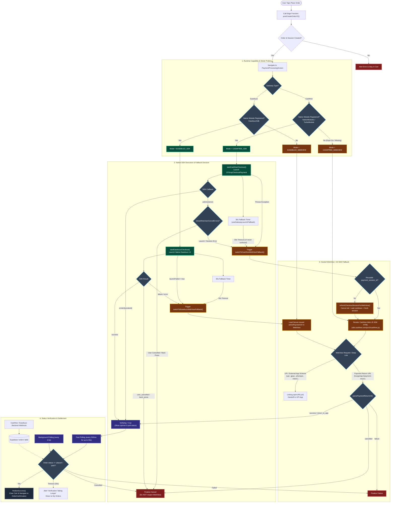

# Payment SDK & Fallback Architecture

This document describes the payment orchestration, runtime capability detection, native SDK integration, error classification, and fallback mechanisms in the HungerTap mobile application.

---

## 1. End-to-End Flowchart

---

## 2. Sequence Diagram (Native SDK vs. Fallback vs. Webhook)

## 3. Architecture & Implementation Details

### 3.1 Lazy Probing Without Crashing in Expo Go
- **File**: [`lib/cashfreeCheckout.js`](../lib/cashfreeCheckout.js) and [`lib/easebuzzCheckout.js`](../lib/easebuzzCheckout.js)
- **Problem**: In React Native / Expo, calling `require('react-native-cashfree-pg-sdk')` or `require('react-native-easebuzz-sdk')` in runtimes lacking the compiled native binary (such as standard Expo Go or unlinked dev builds) causes fatal factory crashes at startup.
- **Solution**: The app probes `NativeModules` and `TurboModuleRegistry` first before executing any lazy `require()`. If absent, it safely reports unavailable and switches to the WebView mode.

### 3.2 Session Reuse Over Order Re-creation
- **File**: [`screens/PaymentProcessingScreen.js`](../screens/PaymentProcessingScreen.js)
- **Problem**: Re-creating an order on fallback creates duplicate pending orders and immediately triggers the backend rate limiter (`enforce_order_rate_limits`: 5s order cooldown).
- **Solution**: The existing `payment_session_id` issued by `create-order-v2` is passed directly into Cashfree's Web JS SDK (`sdk.cashfree.com/js/v3/cashfree.js`) inside an inline HTML shell, reusing the identical checkout session without creating a new order.

### 3.3 Smart Cancellation vs. Launch Failure Classification
- **Function**: `isCashfreeUserCancelError(error)` in [`lib/cashfreeCheckout.js`](../lib/cashfreeCheckout.js)
- **Classification**:
  - If error contains `cancel`, `user_dropped`, `back_press`, or `aborted`: The user deliberately backed out. Checkout finalizes as cancelled and returns to the cart.
  - If error is a technical launch/session fault: Seamlessly activates `switchToCashfreeWebViewFallback()` to ensure the user can still pay.

### 3.4 30-Second Watchdog Timer
- **Hook**: `useGatewayLaunchFallback()` in [`screens/PaymentProcessingScreen.js`](../screens/PaymentProcessingScreen.js)
- If native checkout fails to present its UI within 30 seconds without emitting an explicit error callback, the watchdog timer fires and automatically switches to the WebView fallback.

### 3.5 External UPI App Scheme Interception
- **Function**: `onShouldStartLoadWithRequest()` in [`screens/PaymentProcessingScreen.js`](../screens/PaymentProcessingScreen.js)
- Deep links targeting external payment apps (`upi://`, `intent://`, `gpay://`, `phonepe://`, `paytmmp://`, `bhim://`, `credpay://`) are intercepted and handed over to the OS using React Native's `Linking.openURL()`.

### 3.6 Authoritative Status Reconciliation
- **Webhook**: [`supabase_edge_function_cashfree_webhook_v2.ts`](../supabase_edge_function_cashfree_webhook_v2.ts)
- While client callbacks provide immediate optimistic feedback, final order confirmation is strictly derived from the PostgreSQL `orders` table via polling (`POLL_MS = 2500ms` background, and `500ms` fast verification polling).
