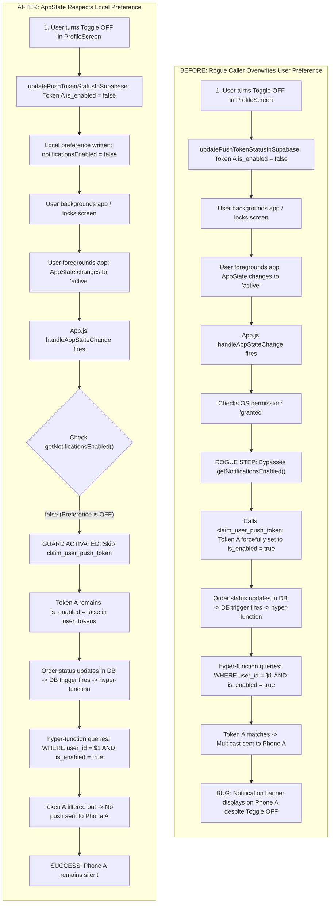
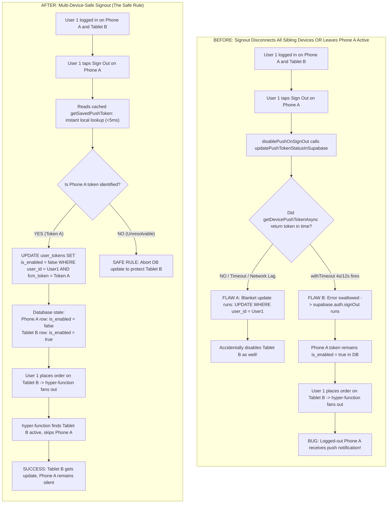
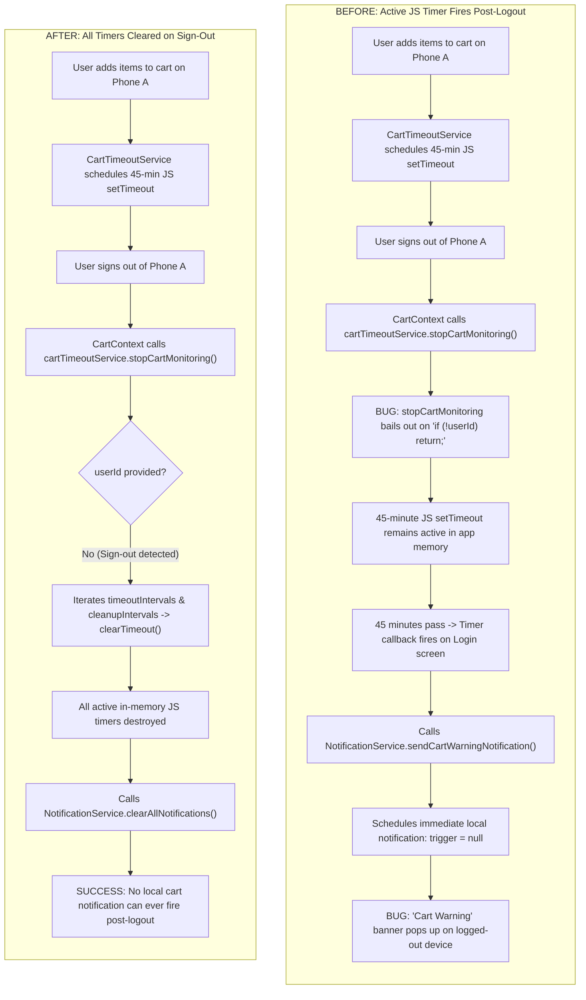
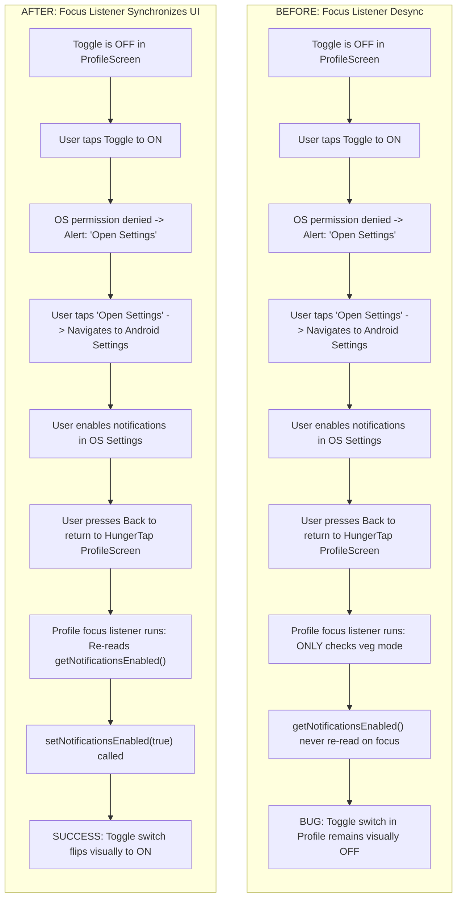
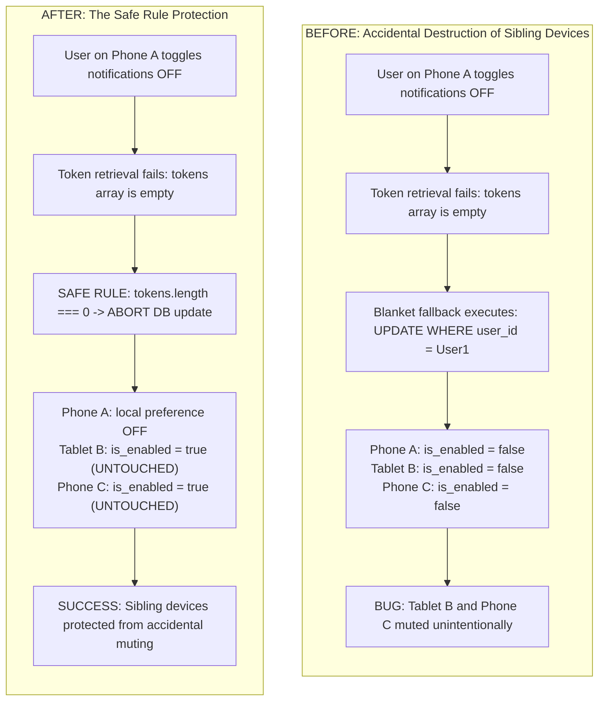

# Comprehensive Audit: Notification Toggle Malfunctions & Multi-Device Signout Handling

**Project**: HungerTap Mobile Application (`hungertap_app21`)  
**Scope**: Push Notifications, Multi-Device Fanout, `claim_user_push_token` Caller Audit, In-App Notification Toggle, Signout Isolation, `hyper-function` Dispatcher  
**Status**: Read-only Audit (No files modified)  

---

## 1. Architectural Principles & Baseline Constraints

Following architectural review, the core invariants for the HungerTap notification system are:

1. **Tokens Are Never Deleted on Toggle or Signout**:
   - For toggle OFF: Keep token row (`user_id = User1, is_enabled = false`) because the user remains logged in on this device.
   - For signout: Keep token row, toggle `is_enabled = false` for this device's token only.
   - Tokens remain registered so re-authentication or re-enabling push does not require re-fetching from FCM/APNs.
2. **The SQL Function `claim_user_push_token` Is Kept As-Is**:
   - The behavior in [`supabase/supabase_schema_latest_2.sql: line 1144`](file:///d:/PROJECTS/hungertap_app21/supabase/supabase_schema_latest_2.sql#L1144):
     `same user + same token → is_enabled = true`
     is standard and correct for device claim/login. It only becomes problematic if called during a lifecycle event that should preserve the user's OFF preference.
   - Therefore, the database function itself should **not** be modified. The defect lies in **who calls it, when, and whether the caller respects the user's local preference**.
3. **Multi-Device Isolation (Per-Device Toggle & Signout)**:
   - A single student account may have multiple active devices:
     ```
     User 1
      ├── Phone A (Token A)
      └── Tablet B (Token B)
     ```
   - If User 1 toggles notifications OFF on Phone A $\rightarrow$ Phone A: NO notifications; Tablet B: YES notifications.
   - If User 1 signs out of Phone A $\rightarrow$ Phone A: NO notifications; Tablet B: YES notifications.
4. **The Safe Rule**:
   > **If the current device cannot be positively identified, do nothing rather than modifying another device's notification state.**
   > Under no circumstances should logout or toggle execute a blanket update (`UPDATE user_tokens SET is_enabled = false WHERE user_id = <user>`), as this would disconnect all sibling devices.

---

## 2. Caller Audit: Who Calls `claim_user_push_token()`?

Postgres RPC `claim_user_push_token(p_fcm_token, p_platform)` is invoked through client wrapper `savePushTokenToSupabase(userId, tokenValue)` in [`lib/services/notifications.js: line 92`](file:///d:/PROJECTS/hungertap_app21/lib/services/notifications.js#L92).

Below is the exhaustive audit of every path that reaches `savePushTokenToSupabase` / `claim_user_push_token`:

| Caller Location | Trigger Event / Lifecycle Condition | Checks Local Notification Preference (`getNotificationsEnabled`)? | Impact on User's OFF Setting |
|---|---|---|---|
| **[`App.js: lines 388–392`](file:///d:/PROJECTS/hungertap_app21/App.js#L388-L392)**<br>`handleAppStateChange` | **App resume to `active`**<br>(Lock/unlock screen, app switch, returning from another app). Runs if OS permission is `granted`. | **NO ❌ (Completely ignored)**<br>Checks only OS permission: `if (status === 'granted')`. | **CRITICAL ROGUE CALLER**: Unconditionally calls `claim_user_push_token` on every app resume, forcefully flipping `is_enabled` back to `true` in Supabase after the user turned it off. |
| **[`App.js: lines 428–447`](file:///d:/PROJECTS/hungertap_app21/App.js#L428-L447)**<br>`maybeRegisterPushToken` | App Navigator mount / auth change (`user.id` changes / fresh install). | **YES ✅**<br>`const enabled = await getNotificationsEnabled(); if (!enabled) return;` | Clean. Does not override user preference if already set to `false`. |
| **[`screens/ProfileScreen.js: line 209`](file:///d:/PROJECTS/hungertap_app21/screens/ProfileScreen.js#L209)**<br>`onToggleNotifications` | User explicitly taps toggle switch to **ON** in Profile (`value === true`). | **YES ✅**<br>Triggered exclusively by explicit user intent to turn notifications on. | Clean. Correctly turns on `is_enabled = true`. |
| **[`screens/CartScreen.js: line 1463`](file:///d:/PROJECTS/hungertap_app21/screens/CartScreen.js#L1463)**<br>`checkout gate` | User taps "Enable notifications" prompt during checkout. | **YES ✅**<br>Triggered by explicit user agreement; also executes `setNotificationsEnabled(true)`. | Clean. Explicit user opt-in. |
| **[`lib/services/notifications.js: line 362`](file:///d:/PROJECTS/hungertap_app21/lib/services/notifications.js#L362)**<br>`setupPushTokenRefreshListener` | OS rotates the native push token in background. | **YES ✅**<br>`if (!(await getNotificationsEnabled().catch(() => true))) return;` | Clean. If toggle is OFF, token refresh does not re-enable the row. |

### Caller Audit Verdict
Out of 5 callers, **4 already respect `getNotificationsEnabled()`**.  
There is exactly **one rogue caller**: **`handleAppStateChange` in [`App.js`](file:///d:/PROJECTS/hungertap_app21/App.js#L373-L398)**.

---

## 3. Confirmed Root Cause for the Toggle Malfunction

### The Single Rogue Caller Sequence
The primary confirmed cause of the toggle malfunction is:
```
Toggle OFF
    ↓
Token A = disabled (is_enabled = false in user_tokens)
    ↓
App backgrounded (user switches apps, locks screen)
    ↓
App foregrounded (transitions back to active)
    ↓
handleAppStateChange() in App.js runs
    ↓
claim_user_push_token(Token A) called because OS permission is 'granted'
    ↓
Token A = enabled again (is_enabled = true in user_tokens)
```

Because `claim_user_push_token` intentionally sets `is_enabled = true` on match, and `handleAppStateChange` never checks `getNotificationsEnabled()`, the user's toggle-off choice is instantly wiped out whenever the phone is locked, unlocked, or resumed.

---

## 4. Post-Signout Notification Taxonomy & Independent Paths

When investigating "notifications arriving after sign-out", we must strictly differentiate between independent delivery paths:

| Notification Type | Observed Content | Likely Source & Root Cause | Mechanism & Remediation |
|---|---|---|---|
| **Order Ready / Status** | `🎉 Order Placed!`<br>`📦 Order Ready!` | **Remote FCM / APNs**<br>(Dispatched by backend `hyper-function`) | **Root Cause**: Phone A token remained `is_enabled = true` in Supabase due to sign-out timeout or failure.<br>**Remediation**: Set Phone A token `is_enabled = false` reliably via instant cached token lookup. |
| **Cart Expiry Warning** | `🛒 Cart Warning: Your cart will expire soon!` | **Local In-Memory JS Timer**<br>(Scheduled inside `CartTimeoutService`) | **Root Cause**: `stopCartMonitoring()` called without arguments on logout bails out immediately (`if (!userId) return;`). Active JS `setTimeout` fires up to 45 mins later.<br>**Remediation**: Clear all timeout handles in `CartTimeoutService` on logout. |
| **Cart Cleared Alert** | `🛒 Cart Cleared` | **Local In-Memory JS Timer**<br>(Scheduled inside `CartTimeoutService`) | **Root Cause**: 24-hour cleanup timeout (`cleanupIntervals`) survived logout.<br>**Remediation**: Clear `cleanupIntervals` on logout. |
| **Stale System Alert** | Notifications received prior to logout | **Local OS Notification Tray / Scheduler** | **Root Cause**: Notifications delivered before logout were not dismissed.<br>**Remediation**: Call `NotificationService.clearAllNotifications()` (`dismissAll` + `cancelAllScheduled`). |

> [!IMPORTANT]
> **This distinction is critical**: Fixing the remote FCM token state in `user_tokens` will **NOT** stop a local JavaScript timer (`CartTimeoutService`) that is already running in app memory. Both independent paths must be addressed.

---

## 5. Multi-Device Sign-Out Architecture: The Safe Rule

### Desired Behavior
```
User 1 (Student)
 ├── Phone A (Signs Out)  ──> Phone A: NO notifications (is_enabled = false for Phone A ONLY)
 └── Tablet B (Stays In)  ──> Tablet B: YES notifications (is_enabled = true for Tablet B)
```

### The 3 Flaws in the Sign-Out Flow

#### Flaw 5.1: The Blanket Fallback Violates Multi-Device Isolation
In [`lib/services/notifications.js: lines 339–346`](file:///d:/PROJECTS/hungertap_app21/lib/services/notifications.js#L339-L346):
```javascript
let query = supabase
  .from('user_tokens')
  .update({ is_enabled: false, updated_at: now })
  .eq('user_id', userId);
// If tokens is empty, it skips this line:
if (tokens.length > 0) query = query.in('fcm_token', tokens);
const { error } = await query;
```
If `tokens` is empty (e.g., token retrieval takes too long or is missing), it executes:
`UPDATE user_tokens SET is_enabled = false WHERE user_id = <userId>;`
**This disables notifications on Phone A, Tablet B, and Phone C simultaneously.**

**The Safe Rule Solution**:
```javascript
if (tokens.length === 0) {
  console.warn('[Push] Safe Rule: Current device token could not be identified. Skipping database update to protect other devices.');
  return { ok: true };
}
```
If the current device cannot be identified, **do nothing** rather than modifying another device's state.

#### Flaw 5.2: Timeout and Error Swallowing Leaves Phone A Enabled
In [`lib/AuthContext.js: lines 1035–1044`](file:///d:/PROJECTS/hungertap_app21/lib/AuthContext.js#L1035-L1044), `disablePushOnSignOut` is subject to a 4s/12s timeout. If `getDevicePushTokenAsync()` hangs on Android (common when Google Play Services is slow or switching networks), the timeout fires, the error is swallowed, and `supabase.auth.signOut()` executes.
Once the session is cleared, Supabase Row Level Security policy `user_tokens_update_own` blocks any subsequent unauthenticated updates. Phone A's row remains `is_enabled: true` in Supabase.
**Solution**: Read `getSavedPushToken()` first from `AsyncStorage` (instant, <5ms, offline-reliable). Do not block on `getDevicePushTokenAsync()`.

#### Flaw 5.3: `CartTimeoutService` Active JS Timers Survive Logout
In [`lib/CartContext.js: line 134`](file:///d:/PROJECTS/hungertap_app21/lib/CartContext.js#L134), `cartTimeoutService.stopCartMonitoring()` is invoked without arguments (`userId = undefined`) when `user` becomes null.
In [`lib/CartTimeoutService.js: line 155`](file:///d:/PROJECTS/hungertap_app21/lib/CartTimeoutService.js#L155), `if (!userId) return;` bails out immediately without clearing timers.
**Solution**: When `stopCartMonitoring` is called without a `userId` (sign-out), clear all active handles in `this.timeoutIntervals` and `this.cleanupIntervals`.

---

## 6. Actionable Implementation Plan (Pure Client-Side)

### Step 1: Fix `App.js` AppState Resume Listener (Rogue Caller)
* **File**: [`App.js: lines 373–398`](file:///d:/PROJECTS/hungertap_app21/App.js#L373-L398)
* **Action**: Check `getNotificationsEnabled()` before calling `registerForPushNotificationsAsync`:
  ```javascript
  const enabled = await getNotificationsEnabled();
  if (status === 'granted' && enabled) {
    console.log('🔄 App resumed — re-syncing FCM token (permission & preference ON)');
    await registerForPushNotificationsAsync(user.id);
    await updatePushTokenStatusInSupabase(user.id, true);
  } else if (status === 'denied' || !enabled) {
    // Keep this device disabled without modifying sibling devices
    await updatePushTokenStatusInSupabase(user.id, false);
  }
  ```

### Step 2: Enforce the Safe Rule & Instant Token Identification in `notifications.js`
* **File**: [`lib/services/notifications.js: lines 320–355`](file:///d:/PROJECTS/hungertap_app21/lib/services/notifications.js#L320-L355)
* **Action**:
  1. Retrieve `savedToken` first from `getSavedPushToken()` (instant local read), fallback to `getDevicePushTokenAsync()`.
  2. Apply the **Safe Rule**:
     ```javascript
     if (tokens.length === 0) {
       console.warn('[Push] Safe Rule: Current device token could not be identified. Skipping database update to protect other devices.');
       return { ok: true };
     }
     ```
  3. Execute `UPDATE user_tokens SET is_enabled = false WHERE user_id = userId AND fcm_token IN (tokens)`.
  4. Never execute a blanket update without `fcm_token IN (tokens)`.

### Step 3: Implement Per-Device Signout Disablement in `disablePushOnSignOut`
* **File**: [`lib/services/notifications.js: lines 213–230`](file:///d:/PROJECTS/hungertap_app21/lib/services/notifications.js#L213-L230)
* **Action**:
  1. Set local preference `setNotificationsEnabled(false)`.
  2. Clear local notifications via `NotificationService.clearAllNotifications()`.
  3. Call `updatePushTokenStatusInSupabase(userId, false)` using the Safe Rule above.
  4. Retains the token row in `user_tokens` (`is_enabled: false`), ensuring Phone A stops receiving while Tablet B continues receiving.

### Step 4: Fix `CartTimeoutService.js` Memory Leak on Sign-Out
* **File**: [`lib/CartTimeoutService.js: lines 155–174`](file:///d:/PROJECTS/hungertap_app21/lib/CartTimeoutService.js#L155-L174)
* **Action**: In `stopCartMonitoring(userId)`:
  If `!userId` (sign-out), clear all timers across `this.timeoutIntervals` and `this.cleanupIntervals`:
  ```javascript
  stopCartMonitoring(userId) {
    if (!userId) {
      for (const id of this.timeoutIntervals.values()) clearTimeout(id);
      this.timeoutIntervals.clear();
      for (const id of this.cleanupIntervals.values()) clearTimeout(id);
      this.cleanupIntervals.clear();
      return;
    }
    ...
  }
  ```

### Step 5: Refresh Toggle on Focus in `screens/ProfileScreen.js`
* **File**: [`screens/ProfileScreen.js: lines 180–194`](file:///d:/PROJECTS/hungertap_app21/screens/ProfileScreen.js#L180-L194)
* **Action**: Add `setNotificationsEnabled(await getNotificationsEnabled());` inside the navigation `focus` listener so returning from Android/iOS system settings immediately synchronizes the toggle UI.

---

## 7. Visual Architectural Workflows (Mermaid Diagrams: Before vs. After)

### Situation 1: In-App Toggle OFF Followed by App Background / Resume Lifecycle



---

### Situation 2: Multi-Device Sign-Out Isolation (Phone A Logs Out, Tablet B Stays Logged In)



---

### Situation 3: In-Memory Cart Expiry Timer Surviving Logout



---

### Situation 4: Returning from System Settings when Granting Permissions



---

### Situation 5: Token Resolution Failure during Disablement (The Safe Rule)


